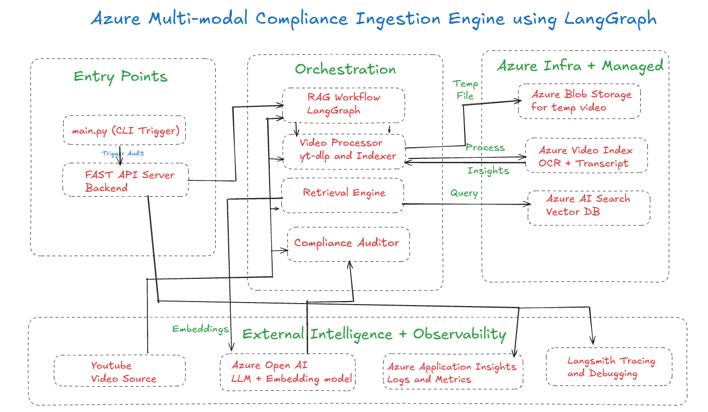
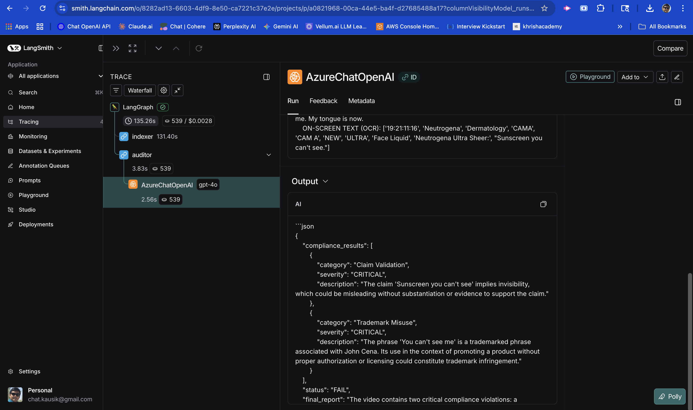

# Compliance QA Pipeline

<p align="center">
  
</p>

A production-oriented **Retrieval-Augmented Generation (RAG)** pipeline for **compliance-focused question answering** over internal documents (policies, SOPs, contracts, audit evidence). The system indexes documents, retrieves relevant passages with citations, and generates grounded answers suitable for regulated environments.

## What this project does

- **Ingests** compliance documents (PDF/DOCX/TXT/MD, etc.)
- **Chunks + embeds** content and stores it in a vector index
- **Retrieves** top-k relevant passages for a user query
- **Generates** an answer grounded in retrieved context
- **Outputs citations** / sources for auditability
- (Optional) **Evaluates** quality (answer relevance/faithfulness, retrieval metrics)

## Key features

- RAG pipeline focused on **traceability** (citations) and **reproducibility**
- Pluggable components: loaders, chunkers, embeddings, vector stores, LLM providers
- Config-driven runs for consistent experiments
- Designed to support common compliance standards (SOC 2, ISO 27001, HIPAA, PCI, etc.)

---

## Repository structure (analyze all folders)

> Update the bullets below to match your exact repository contents. Keep this section accurate: it’s usually the first thing reviewers check.

```text
ComplianceQAPipeline/
├─ assets/                # Logos, diagrams, screenshots (e.g., assets/logo.png)
├─ data/                  # Sample input docs, interim artifacts (avoid committing sensitive docs)
│  ├─ raw/                # Original documents
│  ├─ processed/          # Normalized text / extracted content
│  └─ indexes/            # Vector index artifacts (if stored on disk)
├─ src/                   # Core pipeline code (ingestion, retrieval, generation)
│  ├─ ingestion/          # File loaders, text extraction, chunking
│  ├─ embeddings/         # Embedding model wrappers
│  ├─ vectorstore/        # Vector DB adapters (FAISS/Chroma/Pinecone/etc.)
│  ├─ retrieval/          # Retriever logic, reranking (optional)
│  ├─ llm/                # LLM client wrappers, prompts, guardrails
│  ├─ qa/                 # Orchestration for RAG QA, citation formatting
│  └─ utils/              # Shared helpers (logging, config, IO)
├─ configs/               # YAML/JSON/TOML configs for environments and runs
├─ notebooks/             # Exploration / demos (optional)
├─ scripts/               # CLI entrypoints (build index, run QA, eval)
├─ tests/                 # Unit/integration tests
├─ docs/                  # Additional documentation (architecture, ADRs)
├─ .env.example           # Environment variable template (no secrets)
├─ pyproject.toml         # Or requirements.txt; dependency + tooling config
└─ README.md              # You are here
```

If your repo uses different folder names, replace the above with the actual layout (top-level + important subfolders). For each folder, include:
- Purpose (1 line)
- Key entrypoints (scripts/CLI/modules)
- Main artifacts produced (indexes, cached chunks, logs)

---

## Architecture (high level)

1. **Ingestion**: load documents → extract text → clean/normalize
2. **Chunking**: split into overlapping chunks suitable for retrieval
3. **Embedding**: encode chunks into vectors
4. **Indexing**: store vectors + metadata (doc id, section, page, timestamps)
5. **Retrieval**: similarity search (and optional reranking)
6. **Answering**: LLM generates answer using retrieved context
7. **Citations**: return answer + cited snippets/sources for auditability

### Architecture diagram (LangGraph)

<p align="center">
  
</p>

#### Diagram walkthrough

The LangGraph diagram captures the pipeline as a **directed graph of nodes** with a single request flowing through deterministic steps (and optional branching):

- **Entry / Request**: A user question (or job request) enters the graph with run metadata (session id, config).
- **Ingestion + Indexing (offline/periodic path)**: Documents are loaded, normalized, chunked, embedded, and written to the vector index with metadata (source, section/page, timestamps).
- **Retrieval (online path)**: For each query, the retriever performs similarity search over the index to produce top‑k evidence chunks (optionally followed by reranking).
- **Answer Generation**: The LLM is invoked using the retrieved evidence as grounded context; the prompt enforces citation-first / context-only constraints where applicable.
- **Citations + Formatting**: Retrieved chunk metadata is translated into human-readable citations (document name + location + snippet).
- **Quality / Guardrails (optional nodes)**: The graph may include checks for missing evidence, low confidence, policy violations, or empty retrieval; if triggered, it can branch to fallback behavior (e.g., retrieve-more, refuse, or ask clarifying question).
- **Final Response**: The graph returns the final answer payload (answer + citations + optional confidence/diagnostics).

---

## Setup

### Prerequisites
- Python 3.10+ (recommended)
- (Optional) Docker
- API keys for your chosen LLM/embedding provider (if not fully local)

### Install

Use **one** of the following patterns (match your repo):

```bash
# If using pyproject.toml (recommended)
python -m venv .venv
source .venv/bin/activate
pip install -U pip
pip install -e .

# Or, if using requirements.txt
# pip install -r requirements.txt
```

### Environment variables

Copy and edit:
```bash
cp .env.example .env
```

Common env vars (adjust to your implementation):
- `LLM_PROVIDER` (e.g., openai/azure/local)
- `LLM_MODEL`
- `EMBEDDING_MODEL`
- `VECTORSTORE_PROVIDER`
- `DATA_DIR`
- `INDEX_DIR`

---

## How to run

> Replace the commands with your real entrypoints in `scripts/` or `src/`.

### 1) Build / update the index
```bash
python -m scripts.build_index \
  --input data/raw \
  --output data/indexes \
  --config configs/default.yaml
```

### 2) Ask questions (CLI)
```bash
python -m scripts.ask \
  --query "What are the retention requirements for audit logs?" \
  --index data/indexes \
  --config configs/default.yaml
```

### 3) Run evaluation (optional)
```bash
python -m scripts.evaluate \
  --questions data/eval/questions.jsonl \
  --index data/indexes \
  --out data/eval/results.json \
  --config configs/default.yaml
```

### Run the FastAPI API (development)

From the repository root:

1) Install `uv` (if you don’t have it already)
```bash
pip install uv
# or: pipx install uv
# or: brew install uv
```

2) Sync dependencies
```bash
uv sync
```

3) Start the API server with hot-reload
```bash
uv run uvicorn backend.src.api.server:app --reload
```

Then open:
- API docs (Swagger): `http://127.0.0.1:8000/docs`
- Alternative docs (ReDoc): `http://127.0.0.1:8000/redoc`

Optional (custom host/port):
```bash
uv run uvicorn backend.src.api.server:app --reload --host 0.0.0.0 --port 8000
```

---

## Usage workflow (recommended)

1. Put documents in `data/raw/`
2. Run indexing to generate embeddings + metadata
3. Ask questions via CLI/API
4. Review answers and **citations**
5. Iterate: adjust chunk size, overlap, retrieval k, reranker, prompt, etc.

### Output format (example)

A typical response should include:
- `answer`: final response
- `citations`: list of sources (document name, section/page, snippet)
- `confidence` (optional): heuristic score

---

## Observability (tracing & telemetry)

### LangSmith tracing

<p align="center">
  
</p>

LangSmith is used to trace end-to-end
